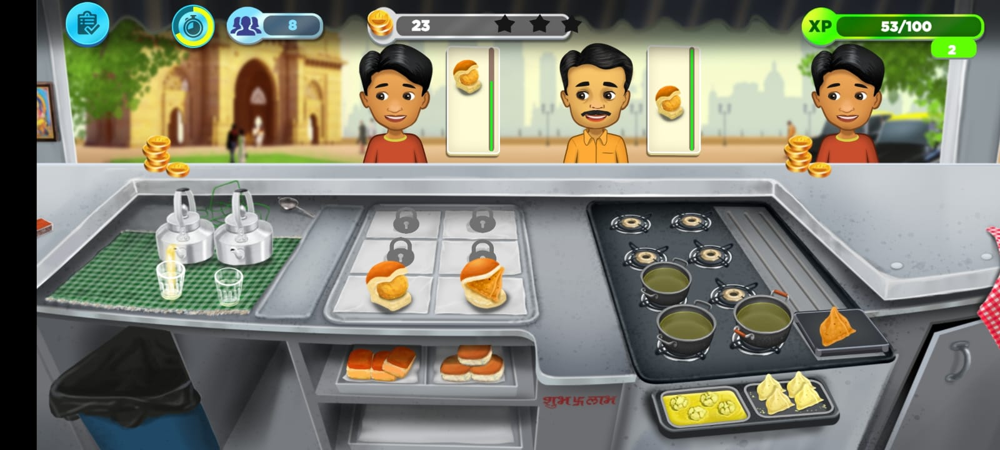
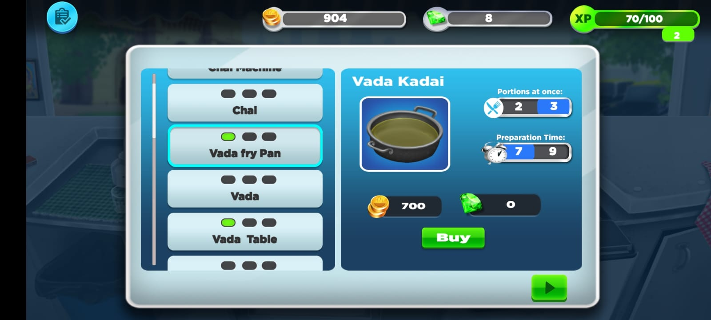

# 🍛 Indian Cooking Mania

**Indian Cooking Mania** is a fun and fast-paced time management cooking game where players run a bustling Indian kitchen. Prepare and serve popular Indian dishes like dosa, pav bhaji, and chai to hungry customers before time runs out!

Built with Unity, this game prototype focuses on engaging cooking mechanics, vibrant UI, and multitasking gameplay. It offers an early glimpse into a casual mobile-style cooking simulator with Indian cultural flavor.

---

## 🎮 Gameplay Overview

You play as a chef in a busy Indian food stall. Your goal is to serve as many customers as possible by preparing the right dishes in the shortest time. If you mess up an order or delay too long, customers leave angry — and you lose points!

---

## ✨ Features

- 🍲 Multiple Indian dishes to prepare (dosa, vada pav, chai, etc.)
- 🧠 Time-based gameplay with increasing difficulty
- 👨‍🍳 Interactive drag-and-drop cooking mechanics
- ⏰ Score and combo tracking based on accuracy and speed
- 📱 Mobile-friendly layout and controls (touch/keyboard)

---

## 🛠️ Tech Stack

- **Engine:** Unity (C#)
- **Target Platforms:** Android and iOS
- **UI:** Unity UI System
- **Version Control:** Git

---

## 🚀 Getting Started

1. Clone the repo:
   ```bash
   git clone https://github.com/yourusername/indian-cooking-mania.git
   ```

2. Open the project in Unity (version used: `2021.3.40` or newer)

3. Press **Play** to run the prototype in the Unity Editor

---

## 📷 Screenshots

| Location Selection | Level Selection | Gameplay Preview | Level Completed | Store | 
|--------------------|-----------------|------------------|-----------------|-------|
|  |  |  |  |   |

---

## 🙌 Credits

- Game Programming: Arti Lanke

---

## 📬 Contact

If you'd like to know more or collaborate, feel free to reach out via [LinkedIn] https://www.linkedin.com/in/arti-lanke/.

---
